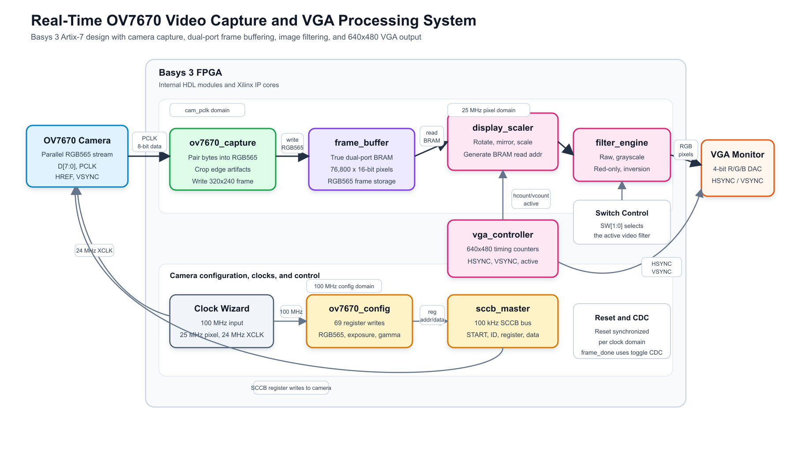

# Final Project Report: Real-Time Video Capture and Processing System

## Group Member

Group name: `<fill in group name>`

| Name | Student Number |
| :---: | :---: |
| `<fill in>` | `<fill in>` |
| `<fill in>` | `<fill in>` |
| `<fill in>` | `<fill in>` |
| `<fill in>` | `<fill in>` |

## Overall Design Block Diagram



Original picture: `report/images/overall_design_block_diagram.png`  
Editable vector version: `report/images/overall_design_block_diagram.svg`

The project implements a live camera-to-monitor video pipeline on the Basys 3 FPGA. The OV7670 camera streams 8-bit video data, `PCLK`, `HREF`, and `VSYNC` into the FPGA. The `ov7670_capture` module pairs two 8-bit transfers into one RGB565 pixel, crops unstable edge data, downsamples the camera stream to a 320 by 240 frame, and writes the pixel to a true dual-port frame buffer. The VGA side reads the frame buffer at the 25 MHz pixel clock, maps the stored image to the 640 by 480 VGA display area, applies a selected filter, and drives the VGA DAC and sync signals.

The design uses these clock and data-transfer domains:

| Clock Domain | Frequency | Main Modules | Purpose |
| :--- | :---: | :--- | :--- |
| `clk_100mhz` | 100 MHz | `top`, `sccb_master`, `ov7670_config` | Basys 3 system clock and OV7670 register configuration |
| `pixel_clk` | 25 MHz | `vga_controller`, `display_scaler`, `filter_engine`, BRAM Port B | VGA timing and display pipeline |
| `cam_xclk` | 24 MHz | Output to OV7670 | Master clock supplied to the camera |
| `cam_pclk` | about 12 to 25 MHz | `ov7670_capture`, BRAM Port A | Camera pixel capture and frame-buffer write side |

The main data path is:

```text
OV7670 camera
  -> ov7670_capture
  -> frame_buffer true dual-port BRAM
  -> display_scaler
  -> filter_engine
  -> VGA DAC and sync outputs
```

The camera configuration path is separate from the video data path:

```text
ov7670_config -> sccb_master -> OV7670 SCCB pins
```

## Design Decision

### 1. Module Architecture

The design is separated into small hardware modules instead of placing all logic in `top.v`. The top-level module only connects the clock generator, camera configuration logic, camera capture logic, frame buffer, VGA timing, display scaler, filter engine, and CDC logic. This makes each part easier to test and debug independently.

This structure has several advantages:

- `ov7670_capture` only handles the camera byte stream and BRAM write addressing.
- `frame_buffer` hides the Xilinx Block Memory Generator IP behind a simple native dual-port RAM interface.
- `vga_controller` only generates standard VGA counters and sync pulses.
- `display_scaler` only handles display-space to frame-buffer address mapping.
- `filter_engine` is purely combinational and can be tested without clocks.
- `sccb_master` and `ov7670_config` isolate camera register configuration from the video pipeline.

This modular structure also made Cocotb test benches practical. Four module-level simulations were run successfully: `filter_engine`, `vga_controller`, `ov7670_capture`, and `sccb_master`.

### 2. Communication Protocols

The OV7670 camera uses SCCB for register configuration. SCCB is very similar to I2C and is the protocol required by the camera module. The FPGA acts as the master and writes register address/data pairs to the camera before video capture begins. The design drives `SCL` and uses an open-drain style `SDA` connection at the top level:

```verilog
assign cam_sda = sda_out ? 1'bz : 1'b0;
```

For pixel data, the design uses the OV7670 parallel video interface instead of a serial protocol. This is appropriate because the camera outputs one byte per `PCLK` cycle, with `HREF` marking valid line data and `VSYNC` marking frame boundaries. Parallel capture avoids the overhead of serializing each pixel and supports real-time display.

For internal frame storage, the design uses the native interface of the Xilinx Block Memory Generator instead of AXI. AXI is more general, but it adds unnecessary complexity for this project. The camera side only needs sequential writes and the display side only needs continuous reads, so a native true dual-port BRAM is simpler and more resource efficient.

### 3. Clock and Data Transfer Rate

The Basys 3 board supplies a 100 MHz input clock. The Clocking Wizard generates:

- 25 MHz `pixel_clk` for VGA 640 by 480 timing.
- 24 MHz `cam_xclk` for the OV7670 master clock.

The 25 MHz pixel clock is close to the standard 25.175 MHz VGA clock for 640 by 480 at about 60 Hz. Most VGA monitors tolerate this small difference, and the timing counters still generate the standard 800 clocks per line and 525 lines per frame:

```text
800 x 525 = 420,000 pixel clocks per frame
25,000,000 / 420,000 = about 59.5 frames per second
```

The camera pixel clock is asynchronous to the VGA pixel clock, so the design does not pass pixel data directly from the camera to VGA. Instead, it writes a complete downsampled frame into BRAM using `cam_pclk`, then reads it using `pixel_clk`. The `frame_done` signal crosses from the camera domain into the pixel domain using a pulse-to-toggle synchronizer and a 3-stage sync register. This prevents a one-cycle pulse from being missed and reduces metastability risk.

### 4. Resource Utilization

The frame buffer is the largest resource in the design:

```text
320 x 240 x 16 bits = 1,228,800 bits
```

This fits within the Basys 3 Artix-7 BRAM capacity. The placed utilization report shows:

| Resource | Used | Available | Utilization |
| :--- | ---: | ---: | ---: |
| Slice LUTs | 409 | 20,800 | 1.97% |
| Slice Registers | 224 | 41,600 | 0.54% |
| Block RAM Tile | 36.5 | 50 | 73.00% |
| DSPs | 1 | 90 | 1.11% |
| Bonded IOB | 37 | 106 | 34.91% |

This confirms that logic usage is low while BRAM usage is intentionally high because a complete frame is stored on chip. This is a reasonable tradeoff because it avoids external memory and allows the camera and display sides to run independently.

The routed timing report shows no setup or hold violations in the reported paths. The worst setup slack was 13.021 ns for the camera clock group and 3.836 ns for the 100 MHz system clock group. The routed power estimate was 0.197 W total on-chip power.

### 5. Other Important Design Decisions

The camera capture module samples on the negative edge of `cam_pclk`. This gives extra timing margin because the OV7670 presents pixel data around its pixel clock transitions.

The capture module stores only even rows and even pixel positions. This converts the 640 by 480 camera stream into a 320 by 240 frame buffer image and keeps memory usage within the FPGA BRAM limit.

The capture module also skips the first few rows and columns. This edge guard removes unstable dummy calibration data that can appear at the beginning of an OV7670 frame.

The display path gates RGB output with `frame_valid`. The display remains black until one complete camera frame has been captured. This prevents uninitialized BRAM data from appearing on the monitor at startup.

The display scaler performs rotation, mirroring, and 1.5x scaling so that the camera image is centered and oriented correctly on the VGA monitor. HSYNC and VSYNC are delayed to align with the BRAM and display pipeline latency.

## Implementation Detail

### Module: `top`

Module code:

```verilog
module top (
    input  wire        clk_100mhz,
    input  wire        rst,
    input  wire [7:0]  cam_d,
    input  wire        cam_pclk,
    input  wire        cam_href,
    input  wire        cam_vsync,
    output wire        cam_xclk,
    output wire        cam_pwdn,
    output wire        cam_rst_n,
    output wire        cam_scl,
    inout  wire        cam_sda,
    output wire [3:0]  vga_r,
    output wire [3:0]  vga_g,
    output wire [3:0]  vga_b,
    output wire        vga_hsync,
    output wire        vga_vsync,
    input  wire [1:0]  sw,
    output wire [2:0]  led
);
```

Important logic:

```verilog
clk_wiz_0 u_clk_wiz (
    .clk_in1   (clk_100mhz),
    .clk_out1  (pixel_clk),
    .clk_out2  (cam_xclk_int),
    .reset     (rst),
    .locked    (pll_locked)
);

assign cam_sda = sda_out ? 1'bz : 1'b0;

reg frame_valid = 1'b0;
always @(posedge pixel_clk) begin
    if (pix_rst) frame_valid <= 1'b0;
    else if (frame_done_pix) frame_valid <= 1'b1;
end
```

Module description:

`top` is the system integration module. It instantiates the Clocking Wizard, ODDR camera clock output, reset synchronizers, SCCB camera configuration modules, camera capture module, frame buffer, VGA controller, display scaler, and sync-delay logic. It also handles the `frame_done` clock-domain crossing between `cam_pclk` and `pixel_clk`.

### Module: `ov7670_capture`

Module code:

```verilog
module ov7670_capture #(
    parameter FRAME_WIDTH  = 320,
    parameter FRAME_HEIGHT = 240
)(
    input  wire        pclk,
    input  wire        rst,
    input  wire        cam_vsync,
    input  wire        cam_href,
    input  wire [7:0]  cam_d,
    output reg         wr_en,
    output reg  [16:0] wr_addr,
    output reg  [15:0] wr_data,
    output reg         frame_done
);
```

Important logic:

```verilog
always @(negedge pclk) begin
    if (rst) begin
        wr_addr    <= 17'd0;
        wr_data    <= 16'd0;
        wr_en      <= 1'b0;
        frame_done <= 1'b0;
        h_cnt      <= 10'd0;
        v_cnt      <= 10'd0;
    end else begin
        wr_en      <= 1'b0;
        frame_done <= 1'b0;

        if (cam_vsync) begin
            wr_addr  <= 17'd0;
            byte_cnt <= 1'b0;
            h_cnt    <= 10'd0;
            v_cnt    <= 10'd0;
        end else if (cam_href) begin
            if (!byte_cnt) begin
                first_byte <= cam_d;
                byte_cnt   <= 1'b1;
            end else begin
                if (h_cnt >= 10'd4 && v_cnt >= 10'd4 &&
                    h_cnt < 10'd644 && v_cnt < 10'd484) begin
                    if (h_cnt[0] == 1'b0 && v_cnt[0] == 1'b0) begin
                        wr_data <= {first_byte, cam_d};
                        wr_en   <= 1'b1;
                        wr_addr <= ({8'd0, v_cnt[9:1] - 9'd2} << 8) +
                                   ({8'd0, v_cnt[9:1] - 9'd2} << 6) +
                                   {8'd0, h_cnt[9:1] - 9'd2};
                    end
                end
                h_cnt    <= h_cnt + 10'd1;
                byte_cnt <= 1'b0;
            end
        end
    end
end
```

Module description:

`ov7670_capture` runs in the camera `PCLK` domain. It pairs two 8-bit camera bytes into one 16-bit RGB565 pixel, skips unstable edge pixels, downsamples by accepting only even horizontal and vertical positions, and generates the frame-buffer write address. It pulses `frame_done` when the camera `VSYNC` period ends.

### Module: `frame_buffer`

Module code:

```verilog
module frame_buffer (
    input  wire        clka,
    input  wire        ena,
    input  wire        wea,
    input  wire [16:0] addra,
    input  wire [15:0] dina,
    input  wire        clkb,
    input  wire        enb,
    input  wire [16:0] addrb,
    output wire [15:0] doutb
);
```

Important logic:

```verilog
blk_mem_gen_0 u_bram (
    .clka  (clka),
    .ena   (ena),
    .wea   (wea),
    .addra (addra),
    .dina  (dina),
    .clkb  (clkb),
    .enb   (enb),
    .web   (1'b0),
    .addrb (addrb),
    .dinb  (16'd0),
    .doutb (doutb)
);
```

Module description:

`frame_buffer` wraps the Xilinx Block Memory Generator IP. Port A is written by the camera domain and Port B is read by the VGA pixel domain. The memory stores one 320 by 240 frame using 16-bit RGB565 pixels.

### Module: `display_scaler`

Module code:

```verilog
module display_scaler (
    input  wire        clk,
    input  wire        rst,
    input  wire [9:0]  hcount,
    input  wire [9:0]  vcount,
    input  wire        active,
    input  wire        frame_valid,
    input  wire [15:0] rd_data,
    output wire [16:0] rd_addr,
    input  wire [1:0]  sw,
    output reg  [3:0]  vga_r,
    output reg  [3:0]  vga_g,
    output reg  [3:0]  vga_b
);
```

Important logic:

```verilog
wire valid_area = (hcount >= 10'd140 && hcount < 10'd500 && vcount < 10'd480);
wire [8:0] screen_x = hcount - 10'd140;

wire [16:0] scaled_x_full = screen_x * 8'd171;
wire [17:0] scaled_y_full = vcount   * 8'd171;

wire [7:0] rot_x = scaled_x_full[15:8];
wire [8:0] rot_y = scaled_y_full[16:8];

wire [8:0] img_x = rot_y;
wire [7:0] img_y = rot_x;

wire [16:0] addr_next =
    ({9'd0, img_y} << 8) + ({9'd0, img_y} << 6) + {8'd0, img_x};

assign rd_addr = (active && valid_area) ? addr_next : 17'd0;
```

Module description:

`display_scaler` converts VGA screen coordinates into frame-buffer addresses. It rotates and mirrors the image, scales the 320 by 240 frame to a centered 360 by 480 display region, reads the pixel from BRAM, passes it through `filter_engine`, and drives 4-bit VGA color outputs. It also gates output until `frame_valid` is set.

### Module: `filter_engine`

Module code:

```verilog
module filter_engine (
    input  wire [15:0] pixel_in,
    input  wire [1:0]  sw,
    output reg  [15:0] pixel_out
);
```

Important logic:

```verilog
wire [4:0] r5 = pixel_in[15:11];
wire [5:0] g6 = pixel_in[10:5];
wire [4:0] b5 = pixel_in[4:0];

wire [13:0] y_scaled = (r5 * 14'd54) + (g6 * 14'd183) + (b5 * 14'd18);
wire [5:0]  y_6bit = y_scaled[13:8] > 6'd63 ? 6'd63 : y_scaled[13:8];
wire [4:0]  y_5bit = y_6bit[5:1];

always @(*) begin
    case (sw)
        2'b00: pixel_out = pixel_in;
        2'b01: pixel_out = {y_5bit, y_6bit, y_5bit};
        2'b10: pixel_out = {r5, 6'b0, 5'b0};
        2'b11: pixel_out = ~pixel_in;
        default: pixel_out = pixel_in;
    endcase
end
```

Module description:

`filter_engine` is a combinational image-processing block. It accepts an RGB565 pixel and applies one of four modes selected by `SW[1:0]`: raw color, grayscale, red-only, or color inversion.

### Module: `vga_controller`

Module code:

```verilog
module vga_controller (
    input  wire        clk,
    input  wire        rst,
    output reg  [9:0]  hcount,
    output reg  [9:0]  vcount,
    output wire        hsync,
    output wire        vsync,
    output wire        active
);
```

Important logic:

```verilog
localparam H_ACTIVE = 640;
localparam H_FP     = 16;
localparam H_SYNC   = 96;
localparam H_BP     = 48;
localparam H_TOTAL  = 800;

localparam V_ACTIVE = 480;
localparam V_FP     = 10;
localparam V_SYNC   = 2;
localparam V_BP     = 33;
localparam V_TOTAL  = 525;

assign hsync = ~((hcount >= 656) && (hcount < 752));
assign vsync = ~((vcount >= 490) && (vcount < 492));
assign active = (hcount < H_ACTIVE) && (vcount < V_ACTIVE);
```

Module description:

`vga_controller` generates the 640 by 480 VGA timing counters. It counts 800 horizontal pixel clocks per line and 525 lines per frame. It outputs active-low horizontal and vertical sync pulses and an `active` flag for the visible 640 by 480 region.

### Module: `sccb_master`

Module code:

```verilog
module sccb_master #(
    parameter CLK_FREQ   = 100_000_000,
    parameter SCCB_FREQ  = 100_000
) (
    input  wire       clk,
    input  wire       rst,
    input  wire       start,
    input  wire [6:0] dev_addr,
    input  wire [7:0] reg_addr,
    input  wire [7:0] reg_data,
    output reg        scl,
    output reg        sda,
    output reg        done,
    output reg        busy,
    output reg        ack_err
);
```

Important logic:

```verilog
localparam CLK_DIV = CLK_FREQ / (SCCB_FREQ * 4);
wire [7:0] id_byte = {dev_addr, 1'b0};

localparam ST_IDLE    = 4'd0;
localparam ST_START   = 4'd1;
localparam ST_ID      = 4'd2;
localparam ST_REG     = 4'd4;
localparam ST_DATA    = 4'd6;
localparam ST_STOP    = 4'd8;
localparam ST_DONE    = 4'd9;

always @(posedge clk) begin
    if (rst) begin
        scl  <= 1'b1;
        sda  <= 1'b1;
        done <= 1'b0;
        busy <= 1'b0;
    end else begin
        done <= 1'b0;
        case (state)
            ST_IDLE: if (start) begin
                busy    <= 1'b1;
                tx_byte <= id_byte;
                state   <= ST_START;
            end
            ST_DONE: begin
                done  <= 1'b1;
                busy  <= 1'b0;
                state <= ST_IDLE;
            end
        endcase
    end
end
```

Module description:

`sccb_master` generates SCCB write transactions for the OV7670 camera. Each transaction sends a START condition, device ID byte, register address byte, register data byte, and STOP condition. The module derives a 100 kHz SCCB bus rate from the 100 MHz system clock.

### Module: `ov7670_config`

Module code:

```verilog
module ov7670_config (
    input  wire        clk,
    input  wire        rst,
    input  wire        sccb_done,
    output reg         sccb_start,
    output reg  [7:0]  reg_addr,
    output reg  [7:0]  reg_data,
    output reg         cfg_done
);
```

Important logic:

```verilog
localparam N_REGS = 69;

always @(*) begin
    case (rom_idx)
        7'd0:  current_reg = {8'h12, 8'h80};
        7'd1:  current_reg = {8'h11, 8'h00};
        7'd4:  current_reg = {8'h12, 8'h04};
        7'd5:  current_reg = {8'h40, 8'hD0};
        7'd68: current_reg = {8'h3d, 8'hc0};
        default: current_reg = {8'hFF, 8'hFF};
    endcase
end

always @(posedge clk) begin
    if (rst) begin
        state      <= S_RESET_WAIT;
        rom_idx    <= 7'd0;
        cfg_done   <= 1'b0;
    end else begin
        sccb_start <= 1'b0;
        case (state)
            S_START_TX: begin
                reg_addr   <= current_reg[15:8];
                reg_data   <= current_reg[7:0];
                sccb_start <= 1'b1;
                state      <= S_WAIT_DONE;
            end
            S_WAIT_DONE: if (sccb_done) begin
                rom_idx <= rom_idx + 7'd1;
                state   <= S_RESET_WAIT;
            end
            S_DONE: cfg_done <= 1'b1;
        endcase
    end
end
```

Module description:

`ov7670_config` stores and sequences the camera register configuration list. It writes 69 register address/data pairs through `sccb_master`, including soft reset, RGB565 output format, color matrix, automatic exposure/gain/white-balance settings, gamma curve, denoise, saturation, and contrast settings.

## Verification and Testbench Result

Cocotb test benches were added for the most important standalone modules and run using Icarus Verilog. The tests passed as follows:

| Test Bench | Module Tested | Result |
| :--- | :--- | :--- |
| `sim/test_filter_engine.py` | `filter_engine` | 8 passed, 0 failed |
| `sim/test_vga_controller.py` | `vga_controller` | 8 passed, 0 failed |
| `sim/test_ov7670_capture.py` | `ov7670_capture` | 6 passed, 0 failed |
| `sim/test_sccb_master.py` | `sccb_master` | 7 passed, 0 failed |

The simulations verified the filter modes, VGA counter and sync timing, camera capture reset/frame/write behavior, and SCCB transaction behavior.

## Challenge Faced

1. The OV7670 camera has many registers, and the configuration sequence is not obvious without reading both the datasheet and existing examples. Small register changes can affect color format, frame timing, exposure, and image orientation.
2. The design has multiple clock domains. The camera pixel clock, VGA pixel clock, and 100 MHz system clock cannot be treated as one timing domain. The `frame_done` signal needed a proper pulse-to-toggle CDC scheme to safely indicate that a complete frame is available.
3. The Basys 3 has enough BRAM for a 320 by 240 RGB565 frame, but not enough for a full 640 by 480 RGB565 frame. The project therefore required downsampling and careful BRAM sizing.
4. Camera edge artifacts appeared near frame boundaries. The capture module solves this by skipping the first few pixels and lines before writing to the frame buffer.
5. Display alignment was challenging because BRAM and display scaling introduce pipeline latency. HSYNC and VSYNC must be delayed to stay aligned with the RGB data.
6. Hardware debugging is harder than software debugging because internal signals are not directly visible on the board. Module-level Cocotb tests helped isolate logic bugs before relying only on Vivado implementation or on-board testing.

