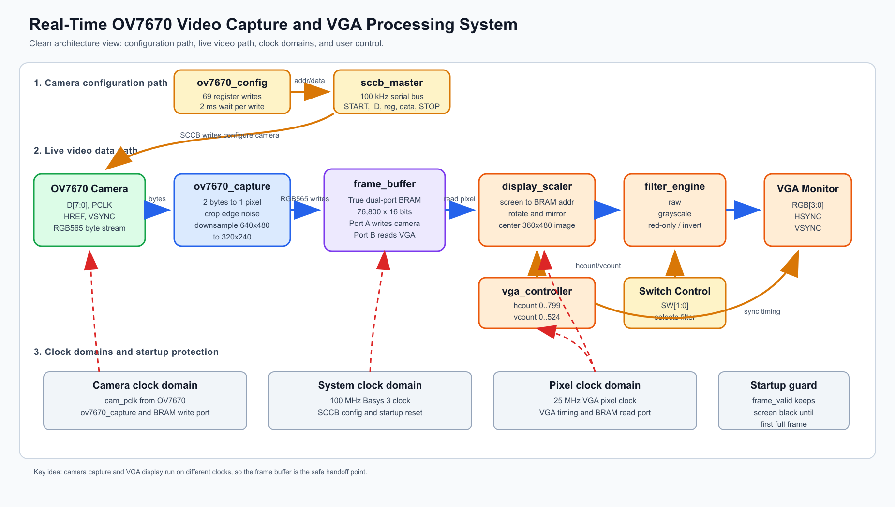
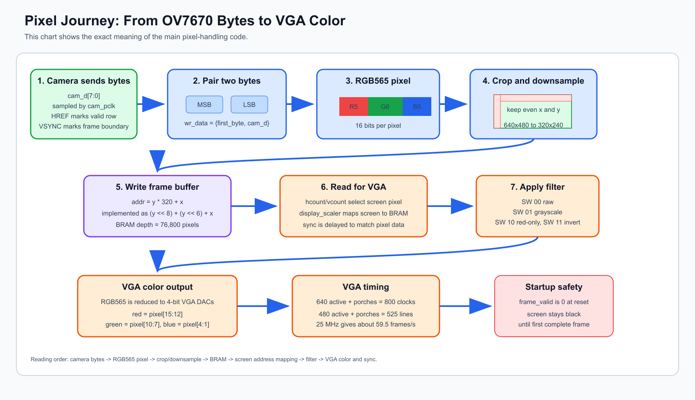

# Final Project Report v2: Real-Time OV7670 Video Capture and VGA Processing System

## Group Member

Group name: `<fill in group name>`

| Name | Student Number |
| :---: | :---: |
| `<fill in>` | `<fill in>` |
| `<fill in>` | `<fill in>` |
| `<fill in>` | `<fill in>` |
| `<fill in>` | `<fill in>` |

---

## 1. Project Summary

This project turns a Basys 3 FPGA board into a live camera-to-monitor system.

The OV7670 camera sends video bytes to the FPGA. The FPGA packs the bytes into RGB565 pixels, stores a 320 x 240 frame in block RAM, reads that frame for VGA display, applies a switch-selected filter, and outputs the result to a VGA monitor.

In one line:

```text
OV7670 camera -> FPGA capture -> frame buffer -> display scaler -> filter -> VGA monitor
```

---

## 2. Overall Design Block Diagram

The following diagram was newly generated for this report. It is designed to be easier to read than the first version by separating the design into three clear paths: camera configuration, live video data, and clock domains.



Image file: `report/images/simple_project_architecture.png`  
Editable vector file: `report/images/simple_project_architecture.svg`

### How to Read the Diagram

| Area | Meaning |
| :--- | :--- |
| Camera configuration path | `ov7670_config` and `sccb_master` write camera registers before useful video capture begins. |
| Live video data path | Camera bytes become RGB565 pixels, are stored in BRAM, then are read for VGA output. |
| Clock domains | The camera, system configuration, and VGA display logic do not all use the same clock. |
| Startup guard | `frame_valid` keeps the display black until a full frame has been captured. |

---

## 3. Pixel Pipeline Diagram

The next generated image focuses on one pixel and shows how it moves through the code.



Image file: `report/images/pixel_pipeline_explainer.png`  
Editable vector file: `report/images/pixel_pipeline_explainer.svg`

The important idea is that the OV7670 does not send a complete pixel at once. It sends one byte at a time. The capture module stores the first byte, waits for the second byte, and then writes one 16-bit RGB565 pixel into the frame buffer.

---

## 4. Hardware Background Needed for This Project

### 4.1 Basys 3 FPGA Board

The Basys 3 board provides:

- Xilinx Artix-7 FPGA logic.
- 100 MHz board clock.
- Push button reset.
- Slide switches for filter selection.
- Pmod pins for the OV7670 camera.
- VGA output pins with a simple resistor-ladder DAC.

The FPGA does not run these modules like software functions. Each Verilog module becomes hardware, and the modules operate in parallel.

### 4.2 OV7670 Camera

The OV7670 is a parallel-output camera. The useful signals in this project are:

| Signal | Direction | Purpose |
| :--- | :--- | :--- |
| `cam_d[7:0]` | Camera to FPGA | One video byte at a time. |
| `cam_pclk` | Camera to FPGA | Pixel byte clock. `ov7670_capture` samples on this clock. |
| `cam_href` | Camera to FPGA | High during valid pixel data in a row. |
| `cam_vsync` | Camera to FPGA | Marks frame boundary. |
| `cam_xclk` | FPGA to camera | Master clock sent to the camera. |
| `cam_scl`, `cam_sda` | FPGA to camera | SCCB/I2C-like register configuration bus. |

### 4.3 RGB565 Pixel Format

The frame buffer stores each pixel as 16 bits:

```text
R[4:0]  G[5:0]  B[4:0]
  5 bits  6 bits  5 bits
```

This is smaller than 24-bit RGB and fits better in the Basys 3 block RAM.

### 4.4 VGA Monitor Output

The project uses 640 x 480 VGA timing. The visible area is 640 x 480, but the monitor also needs blanking and sync periods.

| Timing | Value |
| :--- | ---: |
| Horizontal active pixels | 640 |
| Horizontal total clocks | 800 |
| Vertical active lines | 480 |
| Vertical total lines | 525 |
| Pixel clock | 25 MHz |
| Approximate refresh rate | 25,000,000 / (800 x 525) = 59.5 Hz |

### 4.5 Block RAM Frame Buffer

The full 640 x 480 camera frame would be too large for the Basys 3 BRAM:

```text
640 x 480 x 16 = 4,915,200 bits
```

The design stores a smaller 320 x 240 frame:

```text
320 x 240 x 16 = 1,228,800 bits
```

This fits in the FPGA and allows the camera side and VGA side to use different clocks.

---

## 5. Clock Domains

| Clock | Frequency | Used By | Purpose |
| :--- | :---: | :--- | :--- |
| `clk_100mhz` | 100 MHz | `ov7670_config`, `sccb_master`, reset logic | System and camera configuration clock. |
| `pixel_clk` | 25 MHz | `vga_controller`, `display_scaler`, BRAM read port | VGA display timing. |
| `cam_pclk` | about 12-25 MHz | `ov7670_capture`, BRAM write port | Camera byte capture. |
| `cam_xclk` | Clocking Wizard output | OV7670 camera | Master clock sent to camera. |

Important note: some HDL comments say the camera clock is 24 MHz, but the generated Clocking Wizard IP currently requests 25 MHz for both clock outputs. The design still works as a camera master clock in the expected 24-25 MHz range. If exact 24 MHz is required, output 2 should be changed in the Clocking Wizard IP.

---

## 6. Design Decisions

### 6.1 Modular HDL Architecture

The design is split into small modules instead of putting everything in `top.v`.

| Module | Main Job |
| :--- | :--- |
| `top.v` | Connect all modules, clocks, reset, CDC, BRAM, and VGA outputs. |
| `ov7670_capture.v` | Capture camera bytes and write downsampled RGB565 pixels to BRAM. |
| `ov7670_config.v` | Store and sequence OV7670 register writes. |
| `sccb_master.v` | Generate SCCB serial write transactions. |
| `frame_buffer.v` | Wrap Xilinx true dual-port BRAM. |
| `vga_controller.v` | Generate VGA counters and sync pulses. |
| `display_scaler.v` | Convert VGA screen coordinates into BRAM addresses. |
| `filter_engine.v` | Apply raw, grayscale, red-only, or inverted video filter. |

This structure makes the project easier to debug and test. For example, `filter_engine` can be tested without the camera, and `vga_controller` can be tested without the frame buffer.

### 6.2 Native Dual-Port BRAM Instead of AXI

The project uses native Xilinx Block Memory Generator ports instead of AXI.

Reason:

- The camera only needs to write pixels.
- The VGA display only needs to read pixels.
- A native true dual-port BRAM is simpler than AXI and uses fewer resources.

### 6.3 Downsampling 640 x 480 to 320 x 240

The camera stream is downsampled by keeping only even rows and even pixel positions.

Reason:

- Full 640 x 480 RGB565 does not fit in Basys 3 BRAM.
- 320 x 240 RGB565 fits.
- It still provides a usable live image for VGA display.

### 6.4 Frame Buffer as Clock-Domain Boundary

The camera produces `cam_pclk`, while VGA uses `pixel_clk`. These clocks are not synchronized.

The frame buffer solves this:

- BRAM Port A writes using `cam_pclk`.
- BRAM Port B reads using `pixel_clk`.
- Pixel data does not need to cross directly through normal flip-flops.

### 6.5 Toggle Synchronizer for `frame_done`

`frame_done` is only a one-cycle pulse in the camera clock domain. A one-cycle pulse can be missed by another clock domain.

The design converts the pulse into a toggle, synchronizes the toggle into the pixel clock domain, and detects the edge there. This creates a reliable `frame_valid` flag.

---

## 7. Implementation Details

### 7.1 `top.v`

`top.v` is the integration module. It wires the camera, configuration bus, frame buffer, VGA controller, display scaler, filter engine, clocks, reset, and sync delay.

Important responsibilities:

- Instantiate `clk_wiz_0`.
- Generate `cam_xclk` through an ODDR.
- Hold `cam_pwdn = 0` and `cam_rst_n = 1`.
- Connect `ov7670_config` to `sccb_master`.
- Connect camera capture writes to BRAM Port A.
- Connect VGA reads to BRAM Port B.
- Delay VGA sync to align with display pixel pipeline.
- Create `frame_valid` after the first completed frame.

Key code:

```verilog
assign cam_sda = sda_out ? 1'bz : 1'b0;

wire frame_done_pix = fd_sync[2] ^ fd_sync[1];

always @(posedge pixel_clk) begin
    if (pix_rst) frame_valid <= 1'b0;
    else if (frame_done_pix) frame_valid <= 1'b1;
end
```

### 7.2 `ov7670_capture.v`

This module runs in the camera pixel clock domain. It receives one byte at a time and writes one RGB565 pixel after two bytes have arrived.

Important behavior:

- Resets counters during `cam_vsync`.
- Counts pixels while `cam_href` is high.
- Combines two bytes into `{first_byte, cam_d}`.
- Skips the first 4 rows and first 4 pixel pairs.
- Keeps only even row and even horizontal positions.

Key code:

```verilog
if (h_cnt >= 10'd4 && v_cnt >= 10'd4 &&
    h_cnt < 10'd644 && v_cnt < 10'd484) begin
    if (h_cnt[0] == 1'b0 && v_cnt[0] == 1'b0) begin
        wr_data <= {first_byte, cam_d};
        wr_en   <= 1'b1;
        wr_addr <= ({8'd0, v_cnt[9:1] - 9'd2} << 8) +
                   ({8'd0, v_cnt[9:1] - 9'd2} << 6) +
                   {8'd0, h_cnt[9:1] - 9'd2};
    end
end
```

The address formula is:

```text
addr = row * 320 + col
     = (row << 8) + (row << 6) + col
```

### 7.3 `frame_buffer.v`

This module wraps the Xilinx Block Memory Generator IP.

| Port | Clock | Use |
| :--- | :--- | :--- |
| Port A | `cam_pclk` | Write camera pixels. |
| Port B | `pixel_clk` | Read pixels for VGA display. |

Memory size:

```text
76,800 pixels x 16 bits = one 320 x 240 RGB565 frame
```

The file also includes a behavioral RAM model for Cocotb simulation when `SIMULATION` is defined.

### 7.4 `display_scaler.v`

This module converts the current VGA screen coordinate into a frame-buffer address.

Important behavior:

- Only displays inside a centered 360 x 480 region.
- Scales screen coordinates by 171/256.
- Rotates and mirrors the image by swapping coordinate meaning.
- Gates RGB output until `frame_valid` is high.

Key code:

```verilog
wire valid_area = (hcount >= 10'd140 && hcount < 10'd500 && vcount < 10'd480);
wire [8:0] screen_x = hcount - 10'd140;

wire [16:0] scaled_x_full = screen_x * 8'd171;
wire [17:0] scaled_y_full = vcount   * 8'd171;

wire [7:0] rot_x = scaled_x_full[15:8];
wire [8:0] rot_y = scaled_y_full[16:8];

wire [8:0] img_x = rot_y;
wire [7:0] img_y = rot_x;
```

### 7.5 `filter_engine.v`

This module is combinational logic. It takes one RGB565 pixel and outputs one RGB565 pixel.

| `sw[1:0]` | Mode | Output |
| :---: | :--- | :--- |
| `00` | Raw | Pixel unchanged. |
| `01` | Grayscale | Weighted brightness copied into R, G, and B. |
| `10` | Red only | Red channel kept, green and blue set to zero. |
| `11` | Invert | Bitwise NOT of the 16-bit pixel. |

Grayscale calculation:

```verilog
wire [13:0] y_scaled = (r5 * 14'd54) + (g6 * 14'd183) + (b5 * 14'd18);
wire [5:0]  y_6bit = y_scaled[13:8] > 6'd63 ? 6'd63 : y_scaled[13:8];
wire [4:0]  y_5bit = y_6bit[5:1];
```

### 7.6 `vga_controller.v`

This module generates VGA timing.

| Signal | Meaning |
| :--- | :--- |
| `hcount` | Horizontal counter from 0 to 799. |
| `vcount` | Vertical counter from 0 to 524. |
| `active` | High only inside visible 640 x 480 region. |
| `hsync` | Active-low horizontal sync pulse. |
| `vsync` | Active-low vertical sync pulse. |

Key code:

```verilog
assign hsync  = ~((hcount >= H_SYNC_START) && (hcount < H_SYNC_END));
assign vsync  = ~((vcount >= V_SYNC_START) && (vcount < V_SYNC_END));
assign active = (hcount < H_ACTIVE) && (vcount < V_ACTIVE);
```

### 7.7 `ov7670_config.v` and `sccb_master.v`

`ov7670_config.v` stores 69 register writes. The useful groups are:

- Soft reset.
- Clocking and PLL.
- RGB565 format.
- Windowing.
- Color matrix.
- AEC, AGC, AWB.
- Gamma and stability settings.

`sccb_master.v` sends each register write over SCCB:

```text
START -> device address -> register address -> register data -> STOP
```

The device address used by `top.v` is `7'h21`, so the write ID byte is `8'h42`.

---

## 8. Resource Utilization and Timing

The design uses little LUT/register logic but a lot of BRAM because it stores a full 320 x 240 frame.

| Resource | Used | Available | Utilization |
| :--- | ---: | ---: | ---: |
| Slice LUTs | 409 | 20,800 | 1.97% |
| Slice Registers | 224 | 41,600 | 0.54% |
| Block RAM Tile | 36.5 | 50 | 73.00% |
| DSPs | 1 | 90 | 1.11% |
| Bonded IOB | 37 | 106 | 34.91% |
| BUFGCTRL | 5 | 32 | 15.63% |

Timing summary:

| Item | Result |
| :--- | :--- |
| Setup failing endpoints | 0 |
| Hold failing endpoints | 0 |
| Worst setup slack shown in design summary | 13.021 ns |
| Worst hold slack shown in design summary | 0.154 ns |
| Estimated on-chip power | 0.197 W |

---

## 9. Simulation Coverage

The repository includes Cocotb tests for the most important modules.

| Testbench | What It Checks |
| :--- | :--- |
| `test_filter_engine.py` | Raw, grayscale, red-only, inversion, switch changes. |
| `test_vga_controller.py` | Reset, counter wrap, active area, HSYNC, VSYNC. |
| `test_ov7670_capture.py` | Reset, `frame_done`, edge guard, first valid pixel address, `wr_en` pulse. |
| `test_sccb_master.py` | Idle, busy/done, SCL toggling, START condition, back-to-back writes. |

Last known results:

| Testbench | Result |
| :--- | :--- |
| `test_filter_engine.py` | 8 passed |
| `test_vga_controller.py` | 8 passed |
| `test_ov7670_capture.py` | 6 passed |
| `test_sccb_master.py` | 7 passed |

---

## 10. Challenges Faced

### 10.1 Multiple Clock Domains

The camera, VGA output, and configuration logic do not use the same clock. This required BRAM for pixel transfer and a toggle synchronizer for the frame completion signal.

### 10.2 Limited BRAM

A full 640 x 480 RGB565 frame does not fit in Basys 3 BRAM. The solution was to downsample the camera image to 320 x 240.

### 10.3 Camera Startup and Edge Noise

The OV7670 can output unstable data near the start of frames or rows. The capture module skips a small edge region and keeps the display black until the first complete frame is available.

### 10.4 VGA Pipeline Alignment

BRAM read data is delayed relative to the screen counters. The design delays VGA sync signals so the color data and sync timing stay aligned.

---

## 11. Final Takeaway

The project works because it separates the problem into clear hardware blocks:

```text
configure camera -> capture pixels -> store frame -> map display address -> filter pixel -> output VGA
```

The frame buffer is the most important part of the system. It makes the camera and monitor independent enough to run at their own clocks while still producing a live video display.
